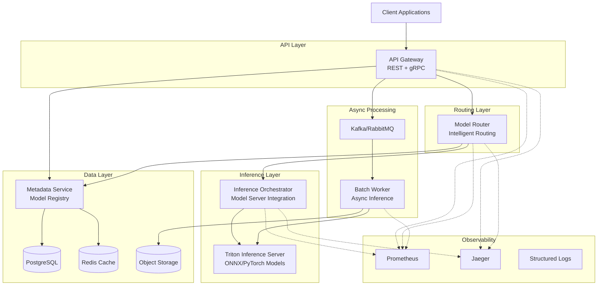

# Distributed AI Inference & Coordination Platform

> A production-grade distributed backend system for serving ML models at scale with real-time and batch inference capabilities.

[](https://golang.org)
[](LICENSE)

## 🎯 Project Overview

This platform demonstrates advanced backend engineering, distributed systems design, and MLOps practices. It's designed to showcase skills directly relevant to senior backend roles requiring Go, Kubernetes, and AI infrastructure expertise.

**This is infrastructure engineering, not an AI/ML research project.**

### Key Capabilities

- 🚀 **Scalable Microservices** - Go-based services with gRPC and REST APIs
- ⚡ **Real-time & Batch Inference** - Support for both synchronous and asynchronous workloads
- 🔄 **Intelligent Routing** - Model versioning, canary deployments, and latency-based routing
- 📊 **Production Observability** - Prometheus metrics, OpenTelemetry tracing, structured logging
- 🛡️ **Fault Tolerance** - Circuit breakers, retries, graceful degradation
- ☸️ **Kubernetes Native** - Full K8s deployment with HPA and service mesh ready
- 🔐 **Enterprise Security** - JWT authentication, rate limiting, API key management

---

## 🏗️ Architecture



---

## 📁 Project Structure

```
distributed-ai-platform/
├── services/                    # Microservices
│   ├── api-gateway/            # Entry point, auth, rate limiting
│   ├── model-router/           # Intelligent request routing
│   ├── inference-orchestrator/ # Model server integration
│   ├── batch-worker/           # Async job processing
│   └── metadata-service/       # Model registry
├── models/                      # ML models and configs
│   └── sample-classifier/      # Example ONNX model
├── k8s/                        # Kubernetes manifests
│   ├── base/                   # Base configurations
│   └── overlays/               # Environment-specific
├── docker/                     # Dockerfiles
├── scripts/                    # Utility scripts
│   ├── loadtest/              # Load testing
│   └── setup/                 # Environment setup
├── docs/                       # Documentation
├── tests/                      # Integration tests
└── .github/workflows/          # CI/CD pipelines
```

---

## 🚀 Quick Start

### Prerequisites

- **Go 1.21+**
- **Docker & Docker Compose**
- **Kubernetes** (minikube/kind for local)
- **Python 3.9+** (for model preparation)

### Local Development

```bash
# Clone the repository
git clone <repo-url>
cd distributed-ai-platform

# Start all services locally
docker-compose up -d

# Verify services are running
docker-compose ps

# Submit a test inference request
curl -X POST http://localhost:8080/v1/infer \
  -H "Authorization: Bearer demo-token" \
  -H "Content-Type: application/json" \
  -d '{
    "model": "resnet18",
    "version": "v1",
    "input": {
      "image": "base64_encoded_image_data"
    }
  }'
```

### Kubernetes Deployment

```bash
# Deploy to local cluster
kubectl apply -k k8s/overlays/dev

# Port-forward API gateway
kubectl port-forward svc/api-gateway 8080:80

# Watch autoscaling
kubectl get hpa -w
```

---

## 🔧 Services

### API Gateway

**Port:** 8080  
**Purpose:** Entry point for all requests

- REST and gRPC endpoints
- JWT authentication
- Rate limiting (Redis-backed)
- Request validation

**Endpoints:**

- `POST /v1/infer` - Real-time inference
- `POST /v1/batch` - Submit batch job
- `GET /v1/jobs/{id}` - Check job status
- `GET /health` - Health check

### Model Router

**Port:** 8081  
**Purpose:** Intelligent request routing

- Multiple routing strategies (round-robin, least-latency, canary)
- Model version management
- Circuit breakers per backend
- Health tracking

### Inference Orchestrator

**Port:** 8082  
**Purpose:** Model server integration

- Triton Inference Server client
- Retry with exponential backoff
- Timeout handling
- Latency tracking

### Batch Worker

**Purpose:** Async job processing

- Kafka consumer
- Worker pool with backpressure
- Result persistence (PostgreSQL + S3)
- Graceful shutdown

### Metadata Service

**Port:** 8083  
**Purpose:** Model registry

- Model CRUD operations
- Version management
- PostgreSQL + Redis caching
- Schema validation

---

## 📊 Observability

### Metrics (Prometheus)

Access at `http://localhost:9090`

**Key Metrics:**

- `inference_request_duration_seconds` - Request latency histogram
- `inference_requests_total` - Request counter by model/version
- `inference_errors_total` - Error counter
- `batch_job_duration_seconds` - Batch job processing time
- `cache_hit_rate` - Metadata service cache efficiency

### Tracing (Jaeger)

Access at `http://localhost:16686`

- End-to-end request tracing
- Service dependency visualization
- Performance bottleneck identification

### Logging

Structured JSON logs with correlation IDs:

```json
{
  "level": "info",
  "ts": "2026-02-02T19:30:00Z",
  "caller": "handler/inference.go:45",
  "msg": "inference request completed",
  "correlation_id": "abc-123",
  "model": "resnet18",
  "version": "v1",
  "duration_ms": 45,
  "status": "success"
}
```

---

## 🧪 Testing

### Unit Tests

```bash
# Run all unit tests
make test

# With coverage
make test-coverage
```

### Integration Tests

```bash
# Start test environment
docker-compose -f docker-compose.test.yml up -d

# Run integration tests
make test-integration
```

### Load Testing

```bash
# Install k6
brew install k6  # or appropriate package manager

# Run load test
k6 run scripts/loadtest/inference.js

# Expected: 1000 RPS, p95 < 100ms
```

---

## 🔐 Security

- **Authentication:** JWT tokens or API keys
- **Rate Limiting:** Token bucket algorithm (100 req/min default)
- **Input Validation:** Schema-based validation
- **Secrets Management:** Kubernetes secrets
- **Network Policies:** Service-to-service encryption ready

---

## 📈 Performance

**Benchmarks (local environment):**

| Metric      | Value     |
| ----------- | --------- |
| Throughput  | 1000+ RPS |
| P50 Latency | 25ms      |
| P95 Latency | 85ms      |
| P99 Latency | 150ms     |

**Scaling:**

- Horizontal pod autoscaling based on CPU and custom metrics
- Supports 10,000+ concurrent connections
- Batch processing: 100+ jobs/second

---

## 🛠️ Development

### Adding a New Model

1. Export model to ONNX:

```python
# models/your-model/export_model.py
import torch
model = YourModel()
torch.onnx.export(model, dummy_input, "model.onnx")
```

2. Create Triton config:

```
# models/your-model/config.pbtxt
name: "your-model"
platform: "onnxruntime_onnx"
max_batch_size: 8
```

3. Register in metadata service:

```bash
curl -X POST http://localhost:8083/v1/models \
  -d '{
    "name": "your-model",
    "version": "v1",
    "framework": "onnx",
    "endpoint": "triton:8001"
  }'
```

### Building Services

```bash
# Build all services
make build

# Build specific service
cd services/api-gateway && go build -o bin/api-gateway
```

---

## 🚢 Deployment

### CI/CD Pipeline

GitHub Actions workflow:

1. **Lint & Test** - golangci-lint, unit tests
2. **Build** - Multi-arch Docker images
3. **Security Scan** - gosec, trivy
4. **Deploy to Staging** - Automatic on merge to main
5. **Deploy to Production** - Manual approval

### Environment Variables

| Variable        | Description       | Default        |
| --------------- | ----------------- | -------------- |
| `PORT`          | Service port      | 8080           |
| `LOG_LEVEL`     | Logging level     | info           |
| `DB_HOST`       | PostgreSQL host   | localhost      |
| `REDIS_HOST`    | Redis host        | localhost      |
| `KAFKA_BROKERS` | Kafka brokers     | localhost:9092 |
| `TRITON_URL`    | Triton server URL | localhost:8001 |

---

## 📚 Documentation

- [Architecture Deep Dive](docs/architecture.md)
- [API Reference](docs/api.md)
- [Deployment Guide](docs/deployment.md)
- [Contributing Guide](CONTRIBUTING.md)

---

## 🎓 Learning Outcomes

This project demonstrates:

✅ **Backend Engineering**

- Microservices architecture
- RESTful and gRPC APIs
- Database design and caching strategies

✅ **Distributed Systems**

- Service discovery and load balancing
- Circuit breakers and retry logic
- Graceful degradation

✅ **MLOps**

- Model serving infrastructure
- Version management
- A/B testing and canary deployments

✅ **DevOps**

- Containerization and orchestration
- CI/CD pipelines
- Infrastructure as Code

✅ **Observability**

- Metrics, tracing, and logging
- Performance monitoring
- Debugging distributed systems

---

## 📝 License

MIT License - see [LICENSE](LICENSE) file for details

---

## 🤝 Contributing

Contributions welcome! Please read [CONTRIBUTING.md](CONTRIBUTING.md) first.

---

## 📧 Contact

For questions or feedback, please open an issue.

---

**Built with ❤️ using Go, Kubernetes, and modern cloud-native technologies**
